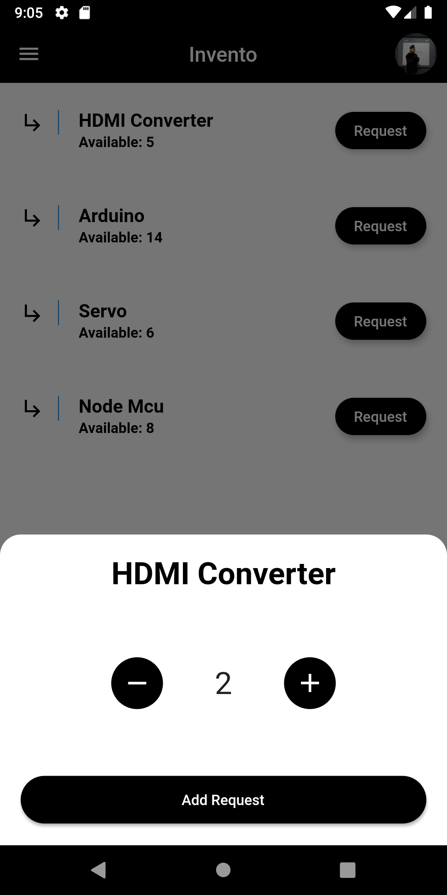
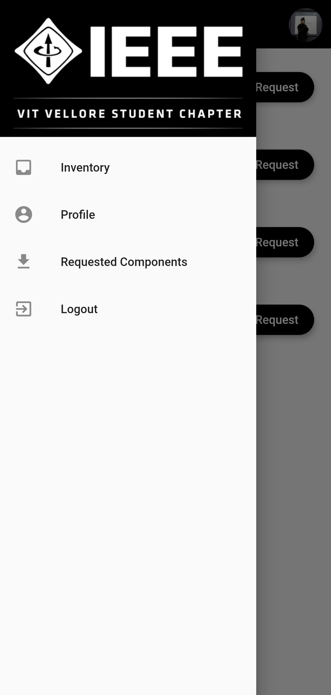
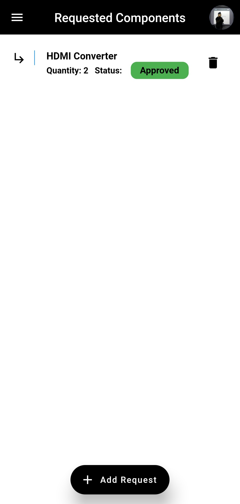

# Invento

This app will help us keep track of our inventory at IEEE-VIT Student Branch. It mainly consists of the electronics components that we use for projects and a variety of other things. 

### A user will be able to:

* Request
* Check the status of a request application 
* Return the component.

### An admin will be able to:
* See all the requests
* Can approve/deny them 
* Add/remove and edit components in the inventory.

## Tools and Technologies used
* Flutter
* Google FireStore for storage and authentication

## App Screenshots:

 
 
 

 
 
 

 
 
 

 
 
 

 
 
 

 
 
 

### To request a component:

* Go to the Inventory page.
* Click the 'Request' button next to the component you want to request.
* Enter the quantity.
* Wait for the admin to approve the request. You can see the status of your application in 'Requested Components'.
* Once approved, you can see the issued component in your 'Profile Page'.

### To return a component:
* Go to your 'Profile Page'.
* Click on 'Return' and confirm to return.

## License
This project is licensed under [MIT License](https://github.com/rish07/Invento/blob/master/LICENSE)
