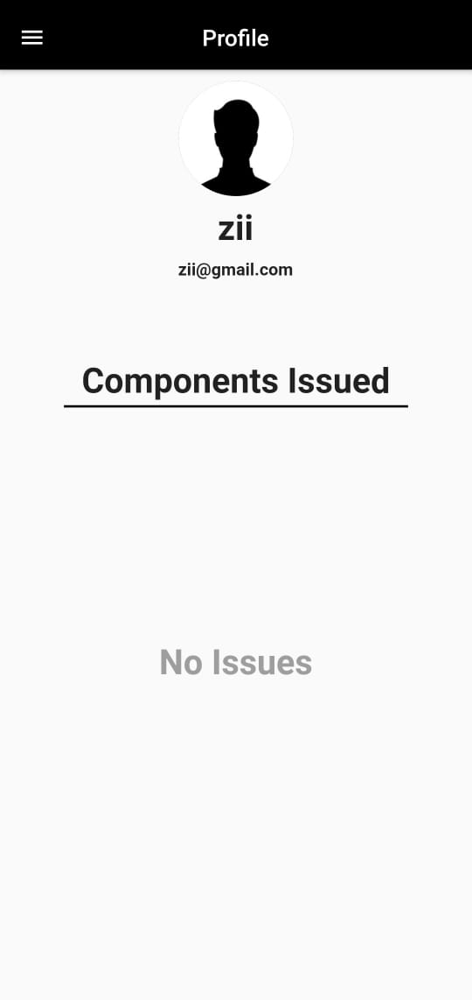
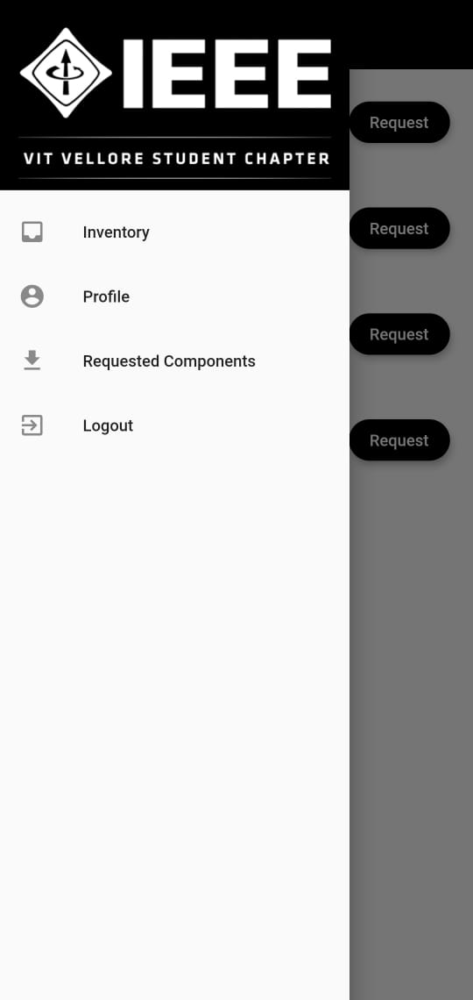
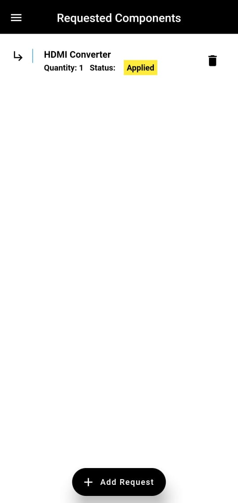

# Invento

This is an app that will help us keep track of our inventory. This mainly consists of the electronics components that we used for projects and
a variety of other things. It would be also be able to display all the components that any certain individual may have at the moment.

## Tools and Technologies used
* Flutter
* Firebase(for storage)

## Images of the app

## License
This project is licensed under [MIT License](https://github.com/rish07/Invento/blob/master/LICENSE)