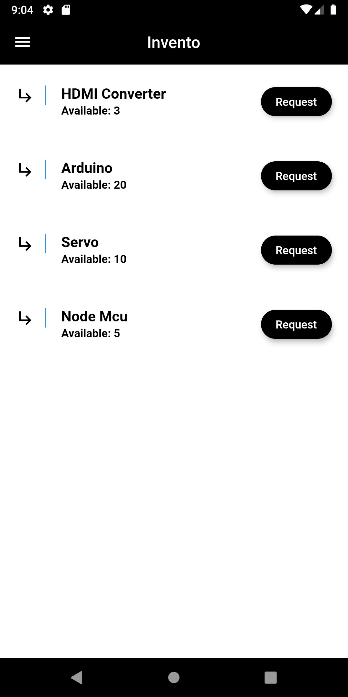
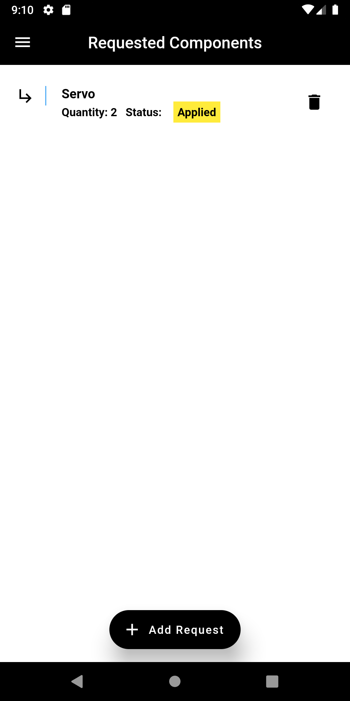
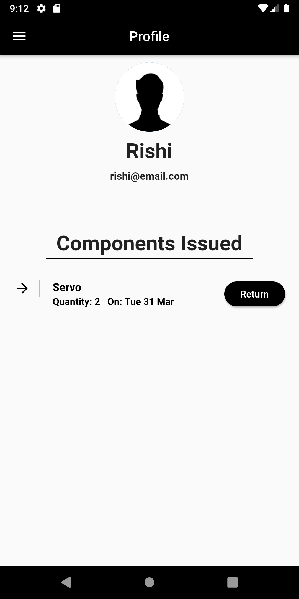

# Invento

This is an app that will help us keep track of our inventory. This mainly consists of the electronics components that we use for projects and
a variety of other things. It would be also be able to display all the components that any certain individual may have at the moment.

## Tools and Technologies used
* Flutter
* FireStore(for storage and authentication)

## App Screenshots:

### To request a component:

* Go to Inventory page.
* Click 'Request' on the component you want to request.
* Enter the quantity.
* Wait for the admin to approve the request. You can see the status of your application in 'Requested Components'.
* Once approved, you can see the issued component in your 'Profile Page'.

### To return a component:
* Go to your 'Profile Page'.
* Click on 'Return' and confirm to return.

## License
This project is licensed under [MIT License](https://github.com/rish07/Invento/blob/master/LICENSE)